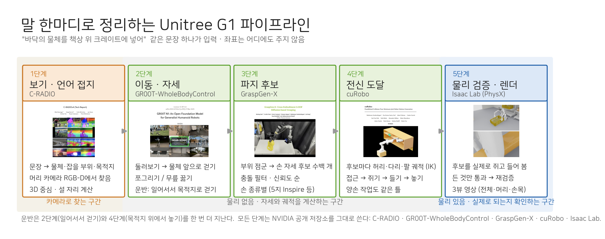
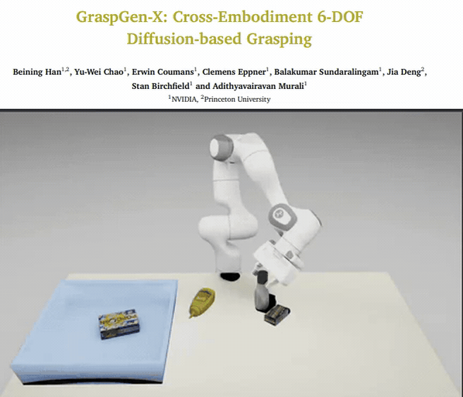
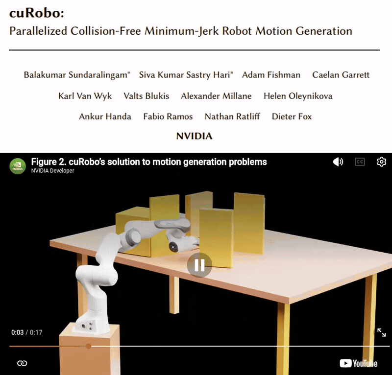
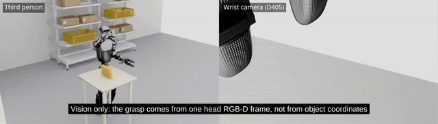
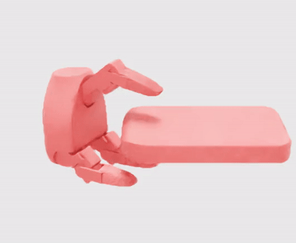

# g1-factory-tidy

The goal is a factory that tidies itself back to a specified state. You hand the
robot an image of what tidy looks like; it compares the floor as it is against
that image and puts back whatever is out of place. What goes where is settled by
the image, not by a person issuing instructions each time.

The robot is never handed the object's coordinates. Where an object is comes out
of the RGB-D cameras on the robot; the true position is read only to score how
far off the estimate was.

What is built so far is one piece of that: a single Unitree G1 finding one object
by vision and picking it up.

## Pipeline



1 see (C-RADIO) → 2 move & posture (GR00T-WholeBodyControl) → 3 grasp candidates (GraspGen-X) →
4 whole-body reach (cuRobo) → 5 physics check & render (Isaac Lab); a carry passes 2 and 4 once more.
The figure is drawn by `scripts/make_pipeline_figure.py`.

Three open-source pieces in series. The only thing a person supplies is "tidy
up"; what is where, how to hold it, and how to get to it are settled by these.

**1. GraspGen-X — what to grasp, and how**



One head RGB-D frame gives a point cloud of the object; grasp candidates are
generated on it and scored. No mesh and no coordinates are handed over -- what
the model sees is the points the camera actually returned.

**2. cuRobo — how to get the arm there**



A collision-free joint trajectory is solved to the grasp pose. Grasps the arm
cannot reach fall out here, which is what picks the candidate that is actually
executable.

**3. GR00T (GEAR-SONIC) — how to get the body there**


If the place the arm can reach from is not the place the robot is standing, it
has to walk. The kinematic planner writes the walk and the whole-body tracking
policy follows it.



A grasp predicted from one head RGB-D frame, executed, and the box lifted. Left is
the third-person view, right is the wrist camera (D405). No object coordinates were
given.

## What works

- Building the cell and viewing it
- Placing the things to be picked up as rigid bodies, on the shelves and on the floor
- Estimating a floor object's position and size from the head camera, scored against truth
- One head RGB-D frame to grasp generation to a planned trajectory to a lift in the cell
- Merging the head and wrist cameras into one point cloud for grasp generation
- Standing and reaching with the pelvis free, on top of whole-body control (SONIC)

## What does not

- Closed loop. The robot looks once before it starts and then executes blind: if the
  box moved mid-reach, nothing would correct for it
- The grasp and whole-body control are not in the same run yet
- Only the right arm's 7 joints are used. Of 36 grasp candidates, 5 were reachable

## The cell

A 6 x 4 m floor with walls on the north and west sides only; south and east are
left open. The west wall has a 1.20 m doorway. G1's shoulders are about 0.45 m
across and a carried crate is 0.60 m on its long side, so that width clears both
at once. The opening is cut full height -- nothing to duck under.

Two racks stand against the north wall
(`Environments/Hospital/Props/SM_MedShelf_01d`).

The static parts -- floor, walls, racks -- are baked once into `map/cell.usd`.
The things to be picked up are not: a rigid body baked into a static shell is
either frozen as scenery or already falling on load. `map/props.py` places them
fresh on every run.

## Where the dimensions come from

The floor box is 0.30 x 0.30 x 0.32 m at 1.5 kg. Those numbers were measured off
the robot (`map/measure_g1_hands.py`): palms 0.326 m apart, 0.21 m in front of
the body. The grip is two hands pressing the side faces, so the box has to be
slightly narrower than that separation for the hands to press inward rather than
reach. At 0.32 m tall the grip point stands 0.16 m off the floor, clear of the
backs of the hands. The same box still fits a shelf (0.374 m between decks,
0.369 m of board depth). Anything bigger is easier to pick up and has nowhere to
go.

## The camera

The real G1 carries an Intel RealSense D435i in its head. Its geometry is kept as
specified -- 86 degree depth field of view, no depth closer than 0.40 m. Only the
resolution is dropped, to 424 x 240. That is not a spec violation: a policy gets
a downsampled image on the real robot too, and it is the one place render time
can be bought back.

The camera is pitched 30 degrees down. G1 has no neck joint -- head_link is fixed
to the torso -- and mounted level it cannot see its own feet: the floor only
enters the frame 1.5 m out. A box 0.9 m away sits on the bottom edge with its
near face cut off, which pushed the estimated centre 76 mm out. Pitched down, the
floor starts at 0.49 m, just outside the depth sensor's own near limit.

That 0.40 m limit is not implemented as a clipping plane. Clipping would delete
the colour image with it, and the real sensor still sees what is close -- it just
returns no depth. The frame is rendered normally and depth below 0.40 m is
discarded afterwards.

## How good the estimate is

Measured from five robot poses. The box was in the same place all five times.

| Robot stands at | Distance | Centre error | Height error |
|---|---|---|---|
| (-2.00, -0.40) facing it | 0.80 m | 6 mm | +2 mm |
| (-2.00, +0.30) facing it | 1.50 m | 8 mm | +3 mm |
| (-1.20, -1.20) from the side | 0.80 m | 1 mm | +2 mm |
| (-2.60, -0.55) diagonally | 0.86 m | 2 mm | +2 mm |
| (-2.00, -0.20) facing it | 1.00 m | 7 mm | +2 mm |

Three reasons not to read too much into that. Only the viewpoint changed, so
nothing here says the estimate survives the object moving. The floor is taken as
z = 0 rather than fitted, which a real robot would have to earn. And the walls
and racks are cut away using the cell's own coordinates -- the object's position
was never given, but the room's layout was.

## Grasp synthesis (early survey)

Grasp poses are not written by hand. They come from
[Dexonomy](https://github.com/JYChen18/Dexonomy), which starts from one
human-annotated template per hand and grasp type, fits the object to that
template, then refines the hand onto the object in simulation. Its supported hand
list includes `Unitree_G1`, and the asset behind that name is `dex_3_1_r.xml` --
the Dex3-1 right hand the real G1 wears. So the hand does not have to be swapped
out to use it.

Three grasp types are annotated for Dex3-1: `1_Large_Diameter`, `3_Medium_Wrap`
and `6_Prismatic_4_Finger`.



A grasp Dexonomy synthesised with `1_Large_Diameter`, playing its approach, grasp
and squeeze poses. The hand alone -- no arm, no body.

## Pick

Grasps come from [GraspGenX](https://github.com/NVlabs/GraspGenX) and the arm
trajectory from [cuRobo](https://github.com/NVlabs/curobo), both through
GraspGenX's own `end2end` pipeline. This repo takes the resulting trajectory
and replays it in the cell.

The hand is the Dex3-1 G1 actually wears. GraspGenX ships a hand under the same
name, but it is a different revision: four of its closing angles are past this
hand's joint limits, so grasps made against it stop short and shove the object.
The right hand is carved out of G1's own URDF and onboarded to GraspGenX as its
own gripper instead.

| | GraspGenX `unitree_g1` | G1's own hand |
|---|---|---|
| index_0 closed | 1.84 | 1.57 |
| index_1 closed | 1.84 | 1.75 |
| middle_0 closed | 1.84 | 1.57 |
| thumb_1 closed | -1.20 | -1.05 |


### The grasp was failing on friction

The same plan that threw the box off the table lifts it once the friction matches.
GraspGenX generates and validates its grasps at an object friction of 10.0 and a
finger-pad friction of 3.0 (the `--object_mu` / `--finger_mu` defaults in
`end2end/e2e_grasp_demo.py`). Nothing was set in the cell, so the replay ran on
PhysX's default of 0.5 -- twenty times less.

| | default mu 0.5 | object 10.0 / fingers 3.0 |
|---|---|---|
| object moved as the fingers close | 93.6 mm | 20.8 mm |
| height at the end | -43 mm (dropped) | +50.6 mm (lifted) |
| verdict | LOST | HELD |

The approach itself moved the box 2.6 mm in both cases. The only place it broke was
the 20 frames the fingers close in.

### Two cameras change which grasps exist

The head camera sits at 0.80 m and barely sees the top of a box on a table: of 1222
observed object points, 3.9% were within 15 mm of the top face. GraspGen conditions
on the observed cloud, so it does not propose a top-down grasp from that -- 2 of 36
candidates were near vertical.

| | points | object z | within 15 mm of the top |
|---|---|---|---|
| head (D435i) | 1436 | 0.766 - 0.888 | |
| wrist (D405) | 2792 | 0.885 - 0.887 | |
| merged | 4228 | | 70.2% |

The merged centre is 4 mm off truth. The merge goes in through GraspGenX's own point
cloud scene format (`scene_loaders.load_graspgenx_json_scene`).

## What the arm can reach

Only the right arm's seven joints -- no waist, no legs. Sampled over 40k
configurations within the joint limits; heights are relative to the torso.

| Palm height | Furthest forward |
|---|---|
| -0.10 | 0.238 |
| -0.05 | 0.294 |
| 0.00 | 0.317 |
| +0.05 | 0.368 |

The palm never gets below torso -0.158, which is why the arm alone cannot pick
anything off the floor.

The head camera sits at torso +0.006 and G1 has no neck joint. For an object to
be in frame it has to be below eye level, and at that height the arm reaches
about 0.30 m. The same holds sideways: pulled in front of the camera (0.10 m
across) the plan solves but the physics diverges; at 0.16 m the IK fails
outright. The placement that works is 0.23 m, and there the object sits at the
edge of the frame.

## Built on

| What | Where |
|---|---|
| Grasp generation | [GraspGenX](https://github.com/NVlabs/GraspGenX) ([arXiv:2606.00998](https://arxiv.org/abs/2606.00998)) |
| Motion planning | [cuRobo](https://github.com/NVlabs/curobo) |
| Whole-body control | [GR00T-WholeBodyControl](https://github.com/NVlabs/GR00T-WholeBodyControl) (SONIC) |
| Grasp synthesis (early survey) | [Dexonomy](https://github.com/JYChen18/Dexonomy) (RSS 2025, [arXiv:2504.18829](https://arxiv.org/abs/2504.18829), [project page](https://pku-epic.github.io/Dexonomy/)) |
| Simulator | [Isaac Sim](https://developer.nvidia.com/isaac/sim) 5.1 / [IsaacLab](https://github.com/isaac-sim/IsaacLab) 2.3.2 |
| Robot | [Unitree G1](https://www.unitree.com/g1) -- IsaacLab's `G1_MINIMAL_CFG` / `G1_29DOF_CFG` |
| Rack / box / tray components | [humanoid-swarm-sim](https://github.com/hooneyskywalker0127/humanoid-swarm-sim) `common/` |
| Rack and carton assets | Isaac Sim `Environments/Hospital/Props`, `Environments/Simple_Warehouse/Props` |

## Files

| File | What it does |
|---|---|
| `map/build_cell.py` | Builds the static shell, saves `map/cell.usd` |
| `map/cell_layout.py` | Dimensions and placements, with the reasoning in the comments |
| `map/props.py` | Places the things to be picked up, as rigid bodies |
| `map/view_cell.py` | Viewer |
| `map/probe_assets.py` | Measures candidate assets instead of guessing from their names |
| `map/measure_g1_hands.py` | Measures G1's hands and shoulders |
| `map/look_from_g1.py` | One frame from the head camera |
| `map/find_box.py` | Estimates the floor object from depth, scores it against truth |
| `map/vision.py` | The estimation, on its own |
| `grasp/traj_from_graspgen.py` | Turns a GraspGenX trajectory into joint values plus object and support poses |
| `grasp/plan_scene.py` | Rebuilds the table and target the plan assumed, in the cell |
| `grasp/play_in_cell.py` | Replays the trajectory; writes a third-person and a head-camera video |
| `grasp/capture_rgbd.py` | Saves one head or wrist RGB-D frame in the format GraspGenX reads |
| `grasp/merge_captures.py` | Merges several captures into one point cloud scene |
| `grasp/probe_wrist_view.py` | Measures which frames put the object in the wrist camera's view |
| `grasp/bake_props_usd.py` | Bakes the plan's table and object into a USD |
| `grasp/reach_clip.py` | Bends a planner clip's right arm onto a grasp point |
| `map/measure_reach.py` | Reach of the arm alone vs arm + waist |
| `common/` | Rack, box and tray components, taken from humanoid-swarm-sim |

## Running it

Needs IsaacLab 2.3.2 / Isaac Sim 5.1.

```
conda activate env_isaaclab
python map/build_cell.py
python map/view_cell.py
```

Grasps and trajectories are produced in the GraspGenX repo
(`end2end/e2e_grasp_demo.py`); its `trajectory.json` comes over here.

```
python grasp/traj_from_graspgen.py <trajectory.json>
python grasp/play_in_cell.py results/g1_graspgen.npy --video results/pick.mp4
```

To save one head-camera frame in GraspGenX's format:

```
python grasp/capture_rgbd.py <x> <y> <yaw> --plan results/g1_graspgen.json \
    --plan-stand <x> <y> <yaw> --out results/capture
```

## Troubleshooting

- The object on the floor is not in frame. G1 has no neck joint -- head_link is
  fixed to the torso -- so where the camera looks is decided by how it is mounted
  and nothing else. Level, at 0.79 m with a 55.7 degree vertical field of view,
  the floor only enters the frame 1.5 m out. An object 0.9 m away sits on the
  bottom edge with its near face cut off, and estimating from that puts the centre
  76 mm out. Pitched 30 degrees down, the floor starts at 0.49 m.
- Depth disappears as the hand closes in. The D435i returns nothing closer than
  0.40 m, so there is no depth through the last stretch before the grasp. The real
  robot has the same hole, which makes it a condition to handle rather than
  something to delete in simulation. Implementing it as a near clipping plane
  takes the colour image with it; render normally and discard depth below 0.40 m,
  which is what the hardware does.
- The point cloud comes back empty and nothing raises. `cam.data.pos_w` and
  `quat_w_ros` read all zeros on a cpu device -- Fabric is disabled there, and
  those buffers are filled through it. Unprojecting depth with a zero quaternion
  turns every point into NaN, and the step that keeps only valid points then
  quietly drops all of them. Read the camera pose off the stage instead.
