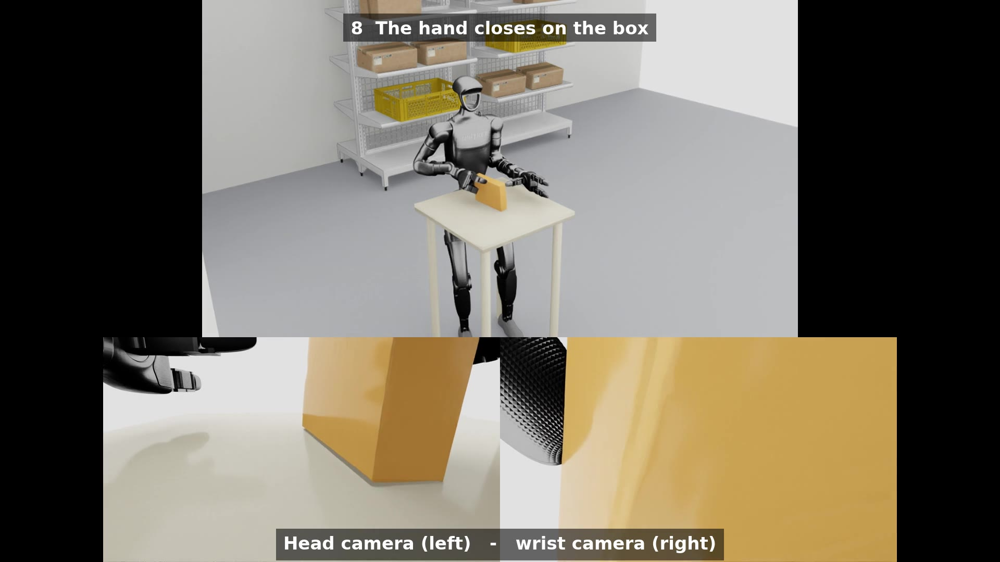

# g1-factory-tidy

한 문장을 받은 휴머노이드가 공장 안에서 물건을 찾고, 걸어가서, 집어 정리하는
파이프라인입니다. Unitree G1 기준이며, 보기·이동·파지·도달을 각각 공개된 오픈소스에
맡기고 Isaac Lab에서 물리로 검증합니다.

[](https://docs.isaacsim.omniverse.nvidia.com/)
[](https://isaac-sim.github.io/IsaacLab/)
[](https://www.python.org/)

[**YouTube**](https://www.youtube.com/playlist?list=PLOijdB1dOk8Y) · [**시연 영상**](https://youtu.be/0Tu-V0MvPYc)

[](https://youtu.be/0Tu-V0MvPYc)

> **범위는 시뮬레이션까지입니다.** 하드웨어가 없어 실제 로봇 배포는 하지 않았고,
> sim-to-real 성능을 주장하지 않습니다. 다만 실기에 없는 장치(골반 고정, 순간이동)는
> 쓰지 않고, 손·camera·제어 구조는 실기 구성(Inspire RH56, RealSense D435i, SONIC 정책)을
> 그대로 따릅니다.

로봇에게 물체 좌표를 주지 않는 것이 이 저장소의 전제입니다. 물체 위치는 로봇에 달린
RGB-D camera에서 나오고, 참값은 추정이 얼마나 틀렸는지 채점할 때만 씁니다. 최종 목표는
깔끔한 상태의 이미지 한 장을 주면 로봇이 지금 상태와 비교해 어긋난 것을 치우는 것입니다.

## News

- **[2026-09-30]** 골반 고정 없이 SONIC 정책이 부유 베이스 위에서 걷고 무릎을 꿇습니다. 도달은 도착 후 측정한 자세와 물체 자세에서 cuRobo로 다시 풀고, 정지 구간은 cuRobo 실행 게인으로 계획을 그대로 실행합니다 — 29관절 0.03 rad, 골반 12 mm로 계획과 일치([DIAGNOSIS_opus](docs/DIAGNOSIS_opus.md)).
- **[2026-09-30]** 손가락 게인을 Isaac Lab의 Inspire 값(kp 10)으로. GraspGenX의 kp 2000은 Newton 소프트 접촉용이었고 PhysX에서는 kN 관통 조임이 됐습니다.
- **[2026-09-29]** 바닥의 망치가 처음으로 바닥을 떠났습니다(무릎 자세 + 전신 도달).
- **[2026-09-28]** 물체 콜라이더를 볼록껍질에서 convex decomposition으로. 망치 손잡이가 물리에 없었습니다.
- **[2026-09-24]** 한 문장 → C-RADIO → 파지 → 걷기 → 집기를 스크립트 한 번에(`grasp/pick_by_language.sh`), 자막 영상.
- **[2026-09-22]** 마찰을 GraspGenX 값으로 맞추자 책상 위 상자가 처음 들렸습니다([notes](docs/notes.md#파지가-안-잡히던-이유는-마찰이었습니다-책상-위-상자-dex3)).

## 목차

- [개요](#개요)
- [결과](#결과)
- [데모](#데모)
- [설치](#설치)
- [사용법](#사용법)
- [폴더 구조](#폴더-구조)
- [TODO](#todo)
- [감사의 말](#감사의-말)
- [라이선스](#라이선스)

## 개요


| 단계 | 하는 일 | 도구 |
|---|---|---|
| 0. 보기 | 머리 RGB-D 한 장을 문장으로 채점해 물체와 부위(손잡이)를 찾습니다. 없으면 제자리 회전해 다시 봅니다 | NVIDIA C-RADIO (cuRobo `feature_mapping` 예제) |
| 1. 파지 후보 | 관측된 점구름에서 파지 후보를 만들고 점수를 매깁니다. mesh도 좌표도 주지 않습니다 | [GraspGen-X](https://github.com/NVlabs/GraspGenX) |
| 2. 이동·자세 | 설 자리와 보행·무릎·기립 클립을 만들고, 추적 정책이 부유 베이스 위에서 물리로 수행합니다 | [GR00T-WholeBodyControl](https://github.com/NVlabs/GR00T-WholeBodyControl) (GEAR-SONIC) |
| 3. 전신 도달 | 도착해 취한 자세에서 파지 자세까지 다리·허리·팔을 한 번에 풉니다 | [cuRobo](https://github.com/NVlabs/curobo) |
| 4. 검증·렌더 | 셀 안에서 물리로 재생하고 3뷰 영상을 남깁니다 | Isaac Lab |

운반은 2와 3을 한 번 더 지납니다. 단계별 세부와 측정값은 [docs/notes.md](docs/notes.md),
실패 원인의 기록은 [docs/DIAGNOSIS_opus.md](docs/DIAGNOSIS_opus.md)에 있습니다.

## 결과

**책상 위 상자는 문장 하나로 집어 듭니다. 바닥 도구는 잡는 데까지 왔고, 들고 일어나는 것을 맞추는 중입니다.**

| 무엇 | 결과 | 자세히 |
|---|---|---|
| 머리 camera 물체 위치 추정 (바닥 상자, 5 시점) | 중심 오차 1~8 mm, 높이 +2~3 mm | [notes](docs/notes.md#추정-정확도) |
| 책상 위 상자: 문장 → 파지 → 걷기 → 집기 | 들어 올림 (+50.6 mm), 영상 | [시연 영상](https://youtu.be/0Tu-V0MvPYc) |
| 머리+손목 camera 합성 | 윗면 관측 3.9% → 70.2%, 위에서 내려오는 파지 생성 | [notes](docs/notes.md#camera-두-대를-합치면-파지-방향이-달라집니다) |
| 부유 베이스 보행 (SONIC) | 플래너 클립보다 0.2~0.5 m 짧게/옆으로 섭니다. 측정→재계획 2회로 무릎 위치 오차 0.12~0.14 m | [DIAGNOSIS_opus](docs/DIAGNOSIS_opus.md) |
| 바닥 망치: 무릎 자세에서 cuRobo 도달 | 양무릎 자세에서 0.8~2.9 mm, 실행 뒤 골반 12 mm·관절 0.03 rad | [DIAGNOSIS_opus](docs/DIAGNOSIS_opus.md) |
| 바닥 망치: 조임 | 접촉 269 N 유지(엄지 135 / 대향 70 N), 손가락 사이에 손잡이 | [DIAGNOSIS_opus](docs/DIAGNOSIS_opus.md) |
| 바닥 망치: 들고 일어나기 | **아직 안 됩니다** — 측정 실행과 렌더의 모드 차이로 파지가 1.6 cm 빗나감(수정 중) | [DIAGNOSIS_opus](docs/DIAGNOSIS_opus.md) |

되지 않는 것도 적어 둡니다. 도착 후 한 번 다시 보고 그 뒤에는 눈을 감습니다(실행 중 물체가
움직여도 따라가지 않습니다). 위치 측정은 시뮬 상태 덤프로 대신하며, 실기에서는 상태 추정과
camera가 그 자리를 맡아야 합니다.

## 데모

<table>
  <tr>
    <td align="center"><br/>GraspGen-X — 점구름에서 파지 후보</td>
    <td align="center"><br/>cuRobo — 파지 자세까지의 궤적</td>
  </tr>
  <tr>
    <td align="center"><br/>GR00T — 설 자리까지 걷기</td>
    <td align="center"><br/>머리 camera 한 장으로 집기 (3인칭 | 손목 camera)</td>
  </tr>
</table>

전체 영상: [시연 영상](https://youtu.be/0Tu-V0MvPYc) · [재생목록](https://www.youtube.com/playlist?list=PLOijdB1dOk8Y)

## 설치

환경이 둘입니다.

| 용도 | 환경 | 설치 |
|---|---|---|
| 셀·시뮬·렌더 (2, 4단계) | conda `env_isaaclab` — Isaac Sim 5.1, Isaac Lab 2.3.2 | [Isaac Lab 설치 안내](https://isaac-sim.github.io/IsaacLab/main/source/setup/installation/index.html) |
| 보기·파지·도달 (0, 1, 3단계) | conda `graspgenx` — GraspGenX, cuRobo V2, C-RADIO(torch.hub), `open_clip_torch`, `einops` | [GraspGenX](https://github.com/NVlabs/GraspGenX), [cuRobo](https://github.com/NVlabs/curobo) |

GR00T-WholeBodyControl(SONIC 정책·플래너 ONNX)과 GraspGenX·cuRobo는 로컬 체크아웃을 경로로
참조합니다(`grasp/sonic_control.py`, `grasp/walk_clip.py`, `grasp/reach_from_pose_opus.py`).
스크립트에 로컬 경로(`/home/sehoon/...`)가 박혀 있어 그대로 복제해 돌리기는 아직 어렵습니다([TODO](#todo)).

## 사용법

**1. 셀** — 정적 셸을 굽고 봅니다.
```bash
conda activate env_isaaclab
python map/build_cell.py && python map/view_cell.py
```

**2. 책상 위 상자** — 문장 하나에서 3뷰 영상까지.
```bash
bash grasp/pick_by_language.sh box table          # 단계별 산출물은 results/fable/
bash grasp/compose_fable.sh                       # 영어 자막이 달린 한 영상
```

**3. 바닥 도구** — 보기 → 설 자리 → 걷기+무릎 → 다시 보기 → 파지 후보 → 전신 도달 → 물리 검증.
```bash
RUN=fable40 QUERY="hammer" MESH=hammer_flat.obj OBJ=hammer bash grasp/floor_object_chain.sh
```
걷기·무릎을 물리로 수행한 뒤 측정 자세에서 다시 계획하는 단계별 명령은 영상 폴더의
`evidence/run.sh`와 `note.txt`에 그대로 적혀 있습니다(`DUMP_STATE`, `kneel_from_state_opus.py`,
`clip_tools_opus.py`, `reach_from_pose_opus.py --all-out`, `build_reach_reference_opus.py`,
`rise_reference_opus.py`, `play_in_cell_opus.py --sonic`).

## 폴더 구조

```
map/        셀 생성·치수·물건 배치·viewer, 머리 camera 촬영과 물체 추정
grasp/      보기(C-RADIO), 파지(GraspGenX), 설 자리·보행(GR00T 플래너), 전신 도달(cuRobo),
            레퍼런스 빌드, 셀 안 재생·렌더(SONIC), 전체 체인 스크립트
common/     렉·상자·트레이 부품 (humanoid-swarm-sim)
assets/     Inspire 손이 달린 G1 USD
scripts/    파이프라인 그림
docs/       기술 노트, 진단 기록, 이 README의 그림
results/    생성 결과 (gitignored)
```

| 문서 | 내용 |
|---|---|
| [docs/notes.md](docs/notes.md) | 셀 치수, 손·camera 구성, 추정 정확도, camera 합성, 마찰, 팔 도달 범위, troubleshooting |
| [docs/DIAGNOSIS_opus.md](docs/DIAGNOSIS_opus.md) | 바닥 도구 파지·기립의 실패 원인 기록 (버전별 측정값과 출처) |
| [docs/DIAGNOSIS.md](docs/DIAGNOSIS.md) | 이전 단계의 진단 (책상 위 상자, 걷기 이음매) |
| [docs/GITS.md](docs/GITS.md) | 쓰는 오픈소스 저장소와 읽어야 할 파일 |

## TODO

- [x] 셀과 물건, 머리 camera 물체 추정과 채점
- [x] 문장 → C-RADIO → GraspGenX → cuRobo → 걷기 → 집기 (책상 위 상자)
- [x] 머리+손목 camera 합성
- [x] 골반 고정·순간이동 제거: SONIC 부유 베이스 보행·무릎·기립
- [x] 도착 후 측정 자세·물체 자세에서 cuRobo 재계획, 정지 구간 cuRobo 실행 게인
- [ ] 바닥 망치를 들고 일어나기 (진행 중, 측정 실행을 렌더와 같은 모드로)
- [ ] 크레이트까지 운반하고 넣기
- [ ] 드릴, 드라이버, 크레이트 (집중 대상 4개)
- [ ] 재계획을 렌더 안에서 (온라인 cuRobo)
- [ ] 이미지 한 장(정돈된 상태)과 비교해 치울 것 고르기
- [ ] 로컬 경로를 떼어 내 복제해 돌릴 수 있게

## 감사의 말

- [GraspGenX](https://github.com/NVlabs/GraspGenX) — 파지 생성과 물리 검증 절차(close · hold_after_close · lift). [arXiv:2606.00998](https://arxiv.org/abs/2606.00998)
- [cuRobo](https://github.com/NVlabs/curobo) — 전신 리타게팅 도달, C-RADIO `feature_mapping` 예제, 실행 방식(정지 후 측정 상태에서 재계획, 위치 드라이브 게인).
- [GR00T-WholeBodyControl](https://github.com/NVlabs/GR00T-WholeBodyControl) — GEAR-SONIC 추적 정책과 kinematic planner, 배포 코드의 상체 분할. [arXiv:2511.07820](https://arxiv.org/abs/2511.07820)
- [Isaac Lab](https://github.com/isaac-sim/IsaacLab) — 시뮬레이션, G1·Inspire 설정(`G1_29DOF_CFG`, `G1_INSPIRE_FTP_CFG`), locomanipulation 예제의 손·물체 설정.
- [humanoid-swarm-sim](https://github.com/hooneyskywalker0127/humanoid-swarm-sim) — 렉·상자·트레이 부품. Isaac Sim `Environments/Hospital/Props`, `Simple_Warehouse/Props` 에셋.
- Unitree G1 · Inspire RH56 · Intel RealSense D435i/D405 — 실기 구성의 기준.

## 라이선스

라이선스 파일은 아직 없습니다. 사용하는 오픈소스와 에셋은 각 원 저장소의 조건을 따릅니다.
